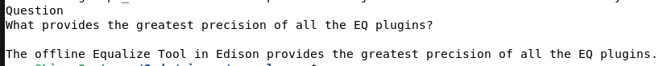
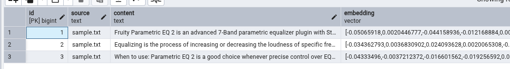

# RAG example

The solution uses a Python project (py-ingest-docs) to ingest and process text documents. The application loads the files and splits them into smaller chunks, with the chunk size limited by the maximum token size supported by the embedding model being used.

Once the documents are chunked, embeddings are generated using OpenAI’s text-embedding-3-small model. These embeddings are then stored in a PostgreSQL database with the pgvector extension enabled, allowing the data to be efficiently queried later by the console application.

The console application, written in C#, accepts a user prompt and queries the vector database to retrieve the most relevant document chunks. The retrieved context is then added to the original prompt and sent to the language model to generate a response.

### Results from user question



The original corpus with the relevant information had a line at the end that read. 

```
When to use: Parametric EQ 2 is a good choice whenever precise control over EQ is required (e.g. Mastering and controlling or enhancing specific frequencies at an instrument level). Alternatively, if screen space is tight use Fruity Parametric EQ, or for a graphic EQ, try EQUO. NOTE: If you require even more precise control over EQ you can click and drag on the plugin window to resize Parametric EQ2 or use the off-line Equalize Tool in Edison provides the greatest precision of all the EQ plugins.
```

### View in database showing emeddings



**Tech used**

* langchain
* openai
* python
* C#
* postgres with pgvector enabled
* docker and docker compose (for environment isolation)


## Running 


### Setup vector DB

This setup uses Docker Compose to manage both the PostgreSQL database and the pgAdmin management UI within a single environment. An explicit Docker network is configured so that other containers and applications can connect to the database consistently across the solution.

The environment is configured to initialise automatically on startup, including creating the database tables required to store text embeddings. It also automatically registers the PostgreSQL instance within pgAdmin, making the database immediately available for management and inspection through the web interface.

```
cd vector-db
docker compose up -d
```

### Generate encodings and write to database

```
cd py-ingest-docs
docker build -t pyingestdocs .
docker run -e OPENAI_API_KEY="" --rm --network rag_network pyingestdocs:latest
```

### Console app to use RAG

```
cd console-app
docker build -t consoleapp .
docker run -e OPENAI_API_KEY="" --rm --network rag_network consoleapp:latest
```
